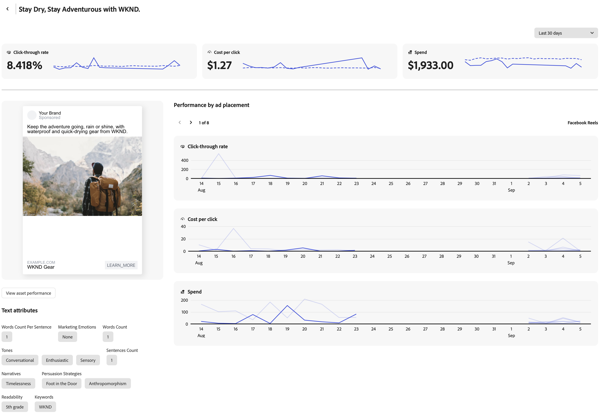

# Présentation des expériences

La vue [!DNL Insights] _[!UICONTROL Expériences]_ affiche une liste de publicités et d’expériences pour le compte publicitaire de canal connecté.

La table [!UICONTROL Expériences] est organisée à l’aide de [!UICONTROL Noms d’annonces]. L’icône de filtre (entonnoir) au-dessus du côté gauche du tableau ouvre le menu **[!UICONTROL Filtre]** où vous pouvez sélectionner les listes [!UICONTROL Compte] et [!UICONTROL Campagne] pour filtrer les noms des publicités dans le tableau.

## Détails de la publicité

Lorsque vous sélectionnez un nom de publicité, vous pouvez afficher les mesures et attributs de performances de la publicité, qui vous permettent d’analyser les mesures d’une expérience en fonction de son emplacement de publicité au cours d’une période spécifiée.

La vue Détails inclut une mesure globale `click-through rate`, `cost per click` et la quantité du budget qui a été `spent` sur la publicité. Comme les publicités peuvent comporter plusieurs emplacements, tels qu’un flux ou une bannière, vous pouvez consulter une ventilation des mêmes mesures pour chaque emplacement d’annonce. Utilisez les flèches gauche et droite sous **[!UICONTROL Performance by ad ad placement]** pour passer en revue les mesures d’emplacement publicitaire.

### Attributs de texte

Sous l’aperçu de la publicité se trouve une liste des [!UICONTROL attributs de texte] associés à la publicité. Lorsque les ressources et les expériences sont approuvées et stockées dans [!DNL Content], GenStudio pour les spécialistes du marketing des performances génère des balises en fonction de leurs fonctionnalités inhérentes. Pour plus d’informations sur les métadonnées du système, voir [Détails de la ressource](../content/asset-details.md#system-metadata) .

### Emplacements de publicité

Au moment de la création d’une campagne avec des métadonnées publicitaires, vous avez peut-être sélectionné l’emplacement où exécuter vos publicités en fonction de l’ [objectif](channels.md#objectives) de la campagne. Les emplacements de publicité élargissent la portée du public pour votre publicité.

GenStudio pour les spécialistes du marketing des performances prend en charge les formats publicitaires, tels que les flux de ressources, les annonces de liens et les images ou vidéos uniques. Voici une liste des formats d’annonce par plateforme :

| Instagram | Facebook/Meta | Messenger | Audience Network |
| --- | --- | --- | --- |
| Explore Explorer La Page D’Accueil Explorer La Grille À L’Accueil Flux Reels Flux De Profil Rechercher Shop Articles | Exploration de l’entreprise  Flux Vidéo en flux continu Marketplace Reels Superposition de sous-marins Colonne de droite Recherche Articles Flux vidéo Publicités sur des sous-marins Facebook | Inbox Stories | Native, Bannière et spot Native Rewarted Video |

## Mesures

Les mesures de statistiques peuvent vous aider à évaluer quelles expériences contribuent au succès d’une campagne et quels emplacements publicitaires sont les plus efficaces.

### Détails des mesures

Le tableau suivant fournit des définitions et des informations sur les mesures de marketing numérique clés dans la vue [!UICONTROL Expériences]. Chaque mesure comprend une brève définition en ce qui concerne les noms des publicités, la manière dont la mesure est calculée et une ou plusieurs informations pour mieux comprendre son importance et son impact sur une expérience.

| Mesure | Définition | Insight |
| ---------------------- | ----------------------------- | -------------------------------- |
| **[!UICONTROL Campaign]** | Une campagne est un ensemble d’expériences et de publicités conçues pour atteindre un objectif spécifique. | |
| **[!UICONTROL Emplacements de publicité]** | Nombre d’emplacements de publicité pour la publicité ou l’expérience. | Les emplacements de publicité augmentent la portée de l’audience. |
| **[!UICONTROL Assets]** | Nombre de ressources utilisées dans la publicité ou l’expérience. | |
| **[!UICONTROL Impressions]** | Les impressions sont comptabilisées chaque fois que le contenu se charge à l’écran, indépendamment de l’interaction ou de l’affichage. | Un nombre d’impressions élevé peut indiquer une large visibilité, mais pour obtenir de vraies informations sur les performances, prenez en compte d’autres mesures d’engagement. |
| **[!UICONTROL Clics]** | Nombre de fois où les utilisateurs interagissent avec un élément cliquable dans une publicité. Les clics peuvent inclure des clics sur un profil de page ou une image, une réaction après, des partages, des commentaires ou pour afficher le média en plein écran. | Un nombre de clics élevé indique un fort intérêt et un engagement envers le contenu, ce qui peut être efficace et atteindre la bonne audience. |
| **[!UICONTROL CTR]** | Pourcentage d&#39;utilisateurs ayant cliqué sur une publicité. **Calcul** : `clicks` divisé par `impressions` | Un taux de clics élevé indique que le contenu est très pertinent et motivant pour le public dans la messagerie et la conception, et cible effectivement les intérêts du public. |
| **[!UICONTROL CPM]** | Mesure des performances pour le coût ($) par millier d’impressions publicitaires. **Calcul** : somme `spent` divisée par portée, puis multipliée par 1 000 | Une valeur faible peut indiquer une visibilité rentable, en particulier lorsqu’elle est associée à un taux de clics élevé. |
| **[!UICONTROL CPC]** | Coût moyen ($) associé à chaque clic dans une expérience. **Calcul** : montant total `spent` divisé par `clicks` | Des coûts moyens inférieurs peuvent indiquer des dépenses publicitaires rentables, en particulier par rapport à une augmentation des conversions. |
| **[!UICONTROL Dépenser]** | Montant dépensé dans le budget sur une période donnée. | Un montant élevé de dépenses sur une courte période peut indiquer une utilisation rapide, ce qui pourrait conduire à une diminution rapide des ressources. Effectuez le suivi du montant des dépenses par rapport aux mesures de performances clés pour mieux surveiller le retour sur investissement global. |
